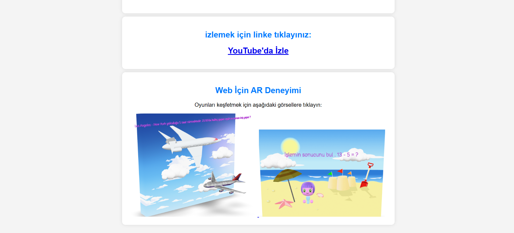
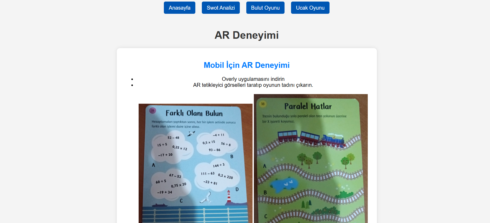
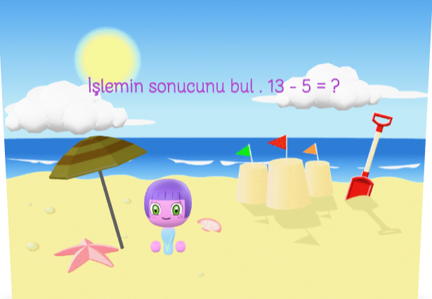
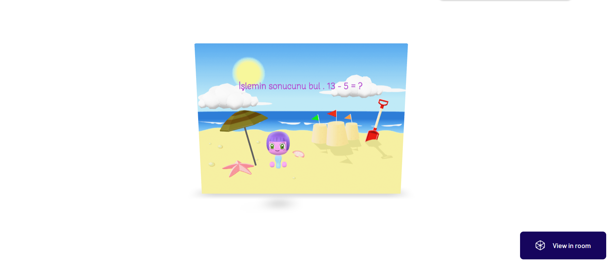
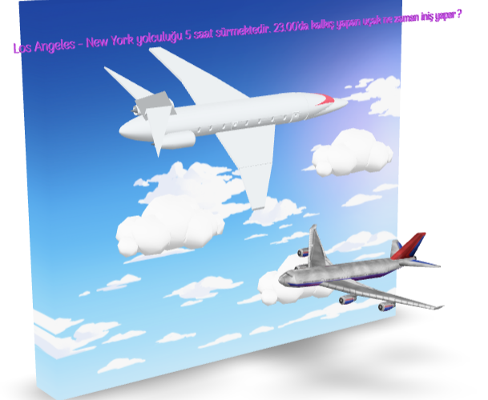
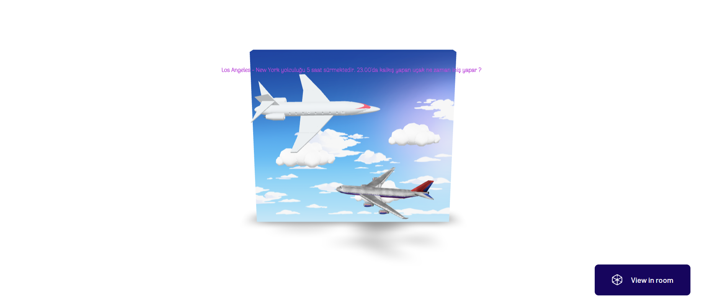

# Ucak Oyunu Projesi - README

Uçak Oyunu projesi, çocuklar için eğlenceli ve eğitici artırılmış gerçeklik (AR) deneyimi sunar. Uçak içi eğlence sistemleri için tasarlanmıştır.

---

## Proje Özellikleri
- Mobil uyumlu ve kullanıcı dostu arayüz.
- Artırılmış gerçeklik (AR) entegrasyonu.
- Sayfa yönlendirmeleri ve bağlantılar (Trello, GitHub, Dökümanlar).
- HTML, CSS, JavaScript ile bir tasarım.

---

## Kullanılan Teknolojiler
- *HTML5*: Web sayfası yapısı.
- *CSS3*: Stil ve tasarım.
- *JavaScript*: Dinamik özellikler.
- *OverlyApp*: AR entegrasyonu.


---

## Kurulum ve Çalıştırma
1. Proje dosyalarını indirin veya klonlayın:
   ```bash
   git clone https://github.com/MustafaBakiVarol/GuncelKonular.git

--- 

## Web Sitesi
[Ucak Oyunu Web Sitesi](https://mustafabakivarol.github.io/GuncelKonular/)

--- 

## Proje Yönetimi
[Ucak Oyunu Proje Yönetimi (Trello)](https://trello.com/b/6XYUOR3e/yazilim-muhendisligi-guncel-konular)

--- 
## Tanıtım Videoları
-[Projenin Genel Tanıtım Videosu]()
-[Oyunların Tanıtım Videosu]()

--- 

## Ekran Görüntüleri
   1.Anasayfa 
  <table>
     <tr>
       <td></td>
    </tr>
        <tr>
       <td></td>
     </tr>
  </table>

    2.Swot Analizi
  <table>
     <tr>
       <td></td>
     </tr>
   </table>

    3. Bulut Oyunu
  <table>
     <tr>
       <td></td>
     </tr>
     <tr>
       <td></td>
     </tr>
  </table>

    4.Ucak Oyunu
  <table>
    <tr>
       <td></td>
     </tr>
    <tr>
       <td></td>
     </tr>
   </table>